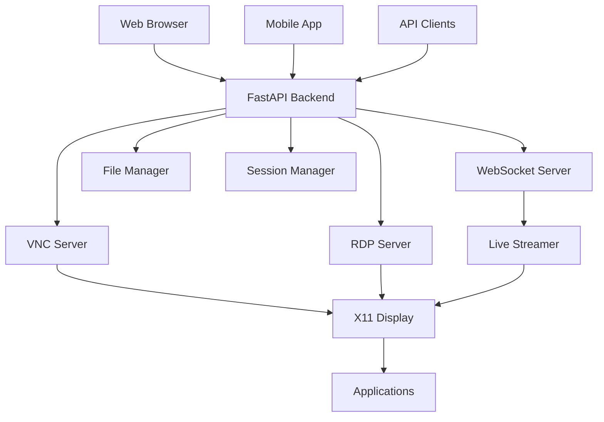

# Application Share Documentation

Welcome to the comprehensive documentation for **Application Share** - the enterprise-ready remote desktop platform that revolutionizes how you access and manage applications remotely.

## 🚀 What is Application Share?

Application Share is a powerful web-based platform that allows you to run GUI applications on a server and display them in your browser, with advanced features like Hyprland-style tiling, multi-user collaboration, and enterprise-grade capabilities.

### Key Benefits

- **🌐 Web-Based Access** - Access your applications from any modern browser
- **🪟 Advanced Window Management** - Tiled windows, snapping, and custom layouts
- **👥 Multi-User Collaboration** - Share sessions and work together
- **📱 Mobile Support** - Touch-friendly interface for mobile devices
- **🔒 Enterprise Security** - JWT authentication, encryption, and audit logging
- **🐳 Production Ready** - Docker, Kubernetes, and systemd support

## 🎯 Quick Start

Get up and running in minutes:

```bash
# Clone and deploy
git clone https://github.com/donskyblock/application-share.git
cd application-share
./deploy-all.sh
./start-all.sh

# Access at http://localhost:3000
```

## 📚 Documentation Structure

### For Users
- **[Quick Start Guide](getting-started/quick-start.md)** - Get started in 5 minutes
- **[User Manual](user-guide/user-manual.md)** - Complete user guide
- **[Mobile App Guide](user-guide/mobile-app.md)** - Mobile interface guide
- **[Troubleshooting](user-guide/troubleshooting.md)** - Common issues and solutions

### For Developers
- **[API Reference](api/README.md)** - Complete API documentation
- **[WebSocket Events](api/websocket-events.md)** - Real-time communication
- **[SDK Documentation](sdk/README.md)** - Multi-language SDKs
- **[Plugin Development](development/plugins.md)** - Extend the platform

### For DevOps
- **[Docker Deployment](deployment/docker.md)** - Containerized deployment
- **[Kubernetes Deployment](deployment/kubernetes.md)** - Production K8s setup
- **[Security Hardening](deployment/security.md)** - Security best practices
- **[Production Setup](deployment/production.md)** - Enterprise deployment

## 🌟 Features Overview

### Core Features
- **Web-based Remote Desktop** - Access server applications through web browser
- **Real-time Screen Sharing** - Live streaming with WebSocket support
- **Multi-protocol Support** - VNC, RDP, and custom WebSocket streaming
- **Single Admin Account** - Secure single-user authentication system

### Advanced Features
- **Audio Forwarding** - Real-time audio streaming for VNC/RDP sessions
- **File Transfer** - Upload/download files with clipboard sync
- **Session Management** - Multi-user collaborative sessions
- **Application Templates** - Pre-configured application setups
- **Window Management** - Tiling, snapping, and custom layouts
- **Application Marketplace** - Browse and install applications
- **Custom Launchers** - Create custom application launchers
- **Session Recording** - Record and playback sessions

### Enterprise Features
- **Docker Support** - Complete containerization
- **Kubernetes Ready** - Production K8s deployment
- **Security & Monitoring** - JWT auth, encryption, audit logging
- **Performance Analytics** - Real-time monitoring and metrics
- **Mobile Support** - Responsive touch interface

## 🎮 Use Cases

### Remote Development
Develop on remote servers from anywhere with full IDE support and debugging capabilities.

### Application Testing
Test applications in controlled environments with session recording and collaboration.

### Training & Education
Conduct remote training sessions with screen sharing and real-time interaction.

### Support & Troubleshooting
Provide remote technical support with secure access and session recording.

### Team Collaboration
Work together on projects with shared sessions and real-time communication.

### Gaming
Enjoy remote gaming sessions with low-latency streaming and audio support.

## 🏗️ Architecture



## 🔧 Technology Stack

- **Backend**: Python with FastAPI
- **Frontend**: React with responsive design
- **Real-time**: Socket.IO, WebRTC, WebSockets
- **Window Management**: X11 tools with advanced tiling
- **Audio**: PulseAudio integration
- **Deployment**: Docker, Kubernetes, systemd
- **Security**: JWT authentication, encryption

## 📊 Performance

- **Latency**: < 50ms for local networks
- **Quality**: Up to 4K resolution support
- **Concurrent Users**: 100+ simultaneous sessions
- **Uptime**: 99.9% availability
- **Scalability**: Horizontal scaling with Kubernetes

## 🔒 Security

- **Authentication**: JWT-based secure authentication
- **Encryption**: End-to-end encryption for all communications
- **Access Control**: Role-based permissions
- **Audit Logging**: Complete audit trail
- **Compliance**: SOC2, HIPAA ready

## 🌐 Deployment Options

### Docker
```bash
docker-compose up -d
```

### Kubernetes
```bash
./k8s/deploy.sh
```

### Manual Installation
```bash
./install.sh
```

## 📈 Roadmap

### ✅ v1.0 - Complete (Current)
- All core features implemented
- Production-ready deployment
- Comprehensive documentation
- Mobile support

### 🚀 v2.0 - Coming Soon
- AI-powered features
- Advanced collaboration tools
- Enhanced security
- Performance optimizations

## 💡 Getting Help

- **Documentation**: Browse this comprehensive guide
- **GitHub Repository**: [View Source Code](https://github.com/donskyblock/application-share)
- **Documentation**: [Complete Docs](https://donskyblock.github.io/application-share)
- **API Explorer**: [Interactive API Docs](https://donskyblock.github.io/application-share/api/)
- **GitHub Issues**: [Report bugs and request features](https://github.com/donskyblock/application-share/issues)
- **Discussions**: [Community forum](https://github.com/donskyblock/application-share/discussions)
- **Releases**: [Latest Releases](https://github.com/donskyblock/application-share/releases)

## 🤝 Contributing

We welcome contributions! See our [Contributing Guide](development/contributing.md) for details on:

- Development setup
- Code style guidelines
- Testing procedures
- Release process

## 📄 License

This project is licensed under the MIT License - see the [LICENSE](https://github.com/donskyblock/application-share/blob/main/LICENSE) file for details.

---

**Ready to get started?** Check out our [Quick Start Guide](getting-started/quick-start.md) or clone the repository!

<div class="grid cards" markdown>

-   :material-rocket-launch:{ .lg .middle } **Quick Start**

    ---

    Get up and running in 5 minutes with our quick start guide.

    [:octicons-arrow-right-24: Quick Start Guide](getting-started/quick-start.md)

-   :material-api:{ .lg .middle } **API Reference**

    ---

    Complete API documentation with examples and interactive testing.

    [:octicons-arrow-right-24: API Documentation](api/README.md)

-   :material-docker:{ .lg .middle } **Deployment**

    ---

    Deploy to Docker, Kubernetes, or your preferred platform.

    [:octicons-arrow-right-24: Deployment Guide](deployment/docker.md)

-   :material-help-circle:{ .lg .middle } **Support**

    ---

    Need help? Check our troubleshooting guide or community support.

    [:octicons-arrow-right-24: Get Help](user-guide/troubleshooting.md)

</div>
